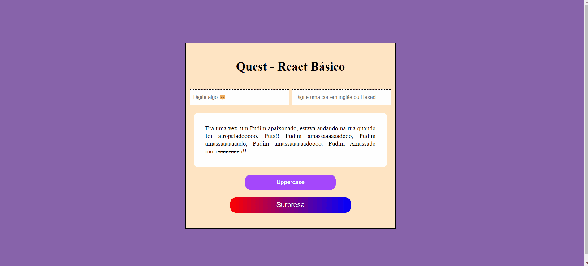

# Quest React Basico
- Mais um desafio do Curso DevQuest, do módulo de React Básico.

## Objetivos
### Em um arquivo React:
- Criar um componente que colore e transforma um texto para maiúsculo (uppercase) utilizando JS.
-- Mostrar mensagem com a label do botão

## Tecnologias utilizadas
- HTML
- CSS
- JavaScript
- React + Vite
  
## Obstáculos
- Conseguir de forma correta, e coesa ultilizar o React;
  - Exemplo: a função useState;
- Conseguir transportar as props para a função, sem cometer erros na sintaxe;
  - Exemplo: saber usar corretamente os códigos, {}, e tags específicas do jsx;

## Solução
- Buscando ajuda nos resumos das aulas do DevQuest;
- Lendo e pesquisando nas documentaçõe;
- E honestamentte, tentando, errando e por fim acertando. Mas sempre aprendendo com os erros;

## Resultado

